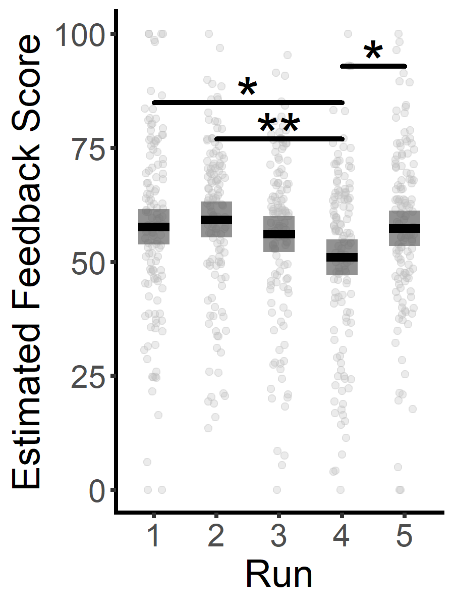

Photographer Behavioral Data Analysis
================

- [Goal](#goal)
- [Load libraries/data](#load-librariesdata)
- [Validation of feedback](#validation-of-feedback)
  - [Result 1. Absence vs. Presence of target objects in the scene on
    feedback
    scores](#result-1-absence-vs-presence-of-target-objects-in-the-scene-on-feedback-scores)
  - [Result 2: ANOVA between the number of target objects and feedback
    scores](#result-2-anova-between-the-number-of-target-objects-and-feedback-scores)
- [Validation of learning](#validation-of-learning)
  - [Result 3: Between-run learning using linear mixed-effect (LME)
    models](#result-3-between-run-learning-using-linear-mixed-effect-lme-models)
  - [Result 4: Between-trial learning (using moving average of feedback
    scores)](#result-4-between-trial-learning-using-moving-average-of-feedback-scores)

## Goal

- Validation of feedback
  - To investigate effects of target objects (i.e., Person, Bicycle, and
    Traffic Light) in captured scenes on feedback scores.
- Validation of learning
  - To identify effects of time (i.e., task runs or trials) on feedback
    scores.
  - Two types of learning effects: Between-run or between-trial learning

## Load libraries/data

``` r
knitr::opts_chunk$set(dpi = 300)

library(tidyverse)
```

    ## ── Attaching core tidyverse packages ──────────────────────── tidyverse 2.0.0 ──
    ## ✔ dplyr     1.1.4     ✔ readr     2.1.5
    ## ✔ forcats   1.0.0     ✔ stringr   1.5.1
    ## ✔ ggplot2   3.5.1     ✔ tibble    3.2.1
    ## ✔ lubridate 1.9.3     ✔ tidyr     1.3.1
    ## ✔ purrr     1.0.2     
    ## ── Conflicts ────────────────────────────────────────── tidyverse_conflicts() ──
    ## ✖ dplyr::filter() masks stats::filter()
    ## ✖ dplyr::lag()    masks stats::lag()
    ## ℹ Use the conflicted package (<http://conflicted.r-lib.org/>) to force all conflicts to become errors

``` r
library(easystats)
```

    ## # Attaching packages: easystats 0.7.3
    ## ✔ bayestestR  0.14.0   ✔ correlation 0.8.5 
    ## ✔ datawizard  0.12.3   ✔ effectsize  0.8.9 
    ## ✔ insight     0.20.4   ✔ modelbased  0.8.8 
    ## ✔ performance 0.12.3   ✔ parameters  0.22.2
    ## ✔ report      0.5.9    ✔ see         0.9.0

``` r
library(ggforce)
library(ggnewscale)
library(rstatix)
```

    ## 
    ## Attaching package: 'rstatix'
    ## 
    ## The following object is masked from 'package:modelbased':
    ## 
    ##     get_emmeans
    ## 
    ## The following objects are masked from 'package:effectsize':
    ## 
    ##     cohens_d, eta_squared
    ## 
    ## The following object is masked from 'package:correlation':
    ## 
    ##     cor_test
    ## 
    ## The following object is masked from 'package:stats':
    ## 
    ##     filter

``` r
library(ggpubr)
```

    ## 
    ## Attaching package: 'ggpubr'
    ## 
    ## The following objects are masked from 'package:datawizard':
    ## 
    ##     mean_sd, median_mad

``` r
library(lmerTest)
```

    ## Loading required package: lme4
    ## Loading required package: Matrix
    ## 
    ## Attaching package: 'Matrix'
    ## 
    ## The following objects are masked from 'package:tidyr':
    ## 
    ##     expand, pack, unpack
    ## 
    ## 
    ## Attaching package: 'lmerTest'
    ## 
    ## The following object is masked from 'package:lme4':
    ## 
    ##     lmer
    ## 
    ## The following object is masked from 'package:stats':
    ## 
    ##     step

``` r
library(broom.mixed)
library(AICcmodavg)
```

    ## 
    ## Attaching package: 'AICcmodavg'
    ## 
    ## The following object is masked from 'package:lme4':
    ## 
    ##     checkConv

``` r
library(emmeans)
```

    ## Welcome to emmeans.
    ## Caution: You lose important information if you filter this package's results.
    ## See '? untidy'

``` r
library(glue)
library(slider)
```

    ## 
    ## Attaching package: 'slider'
    ## 
    ## The following object is masked from 'package:datawizard':
    ## 
    ##     slide

``` r
# Discovery group behavioral data (acquired in 2022)
discovery_behavior_df <-
  read_csv(
    "./data/behavioral_data/group_2022_behavior_feedback.csv",
    col_types = cols(
      subject_id = col_factor(),
      run = col_factor(ordered = TRUE),
      city = col_factor(
        levels = c("New_York", "Boston", "Los_Angeles", "London", "Paris"),
        ordered = TRUE
      ),
      trial = col_factor(ordered = TRUE),
      feedback_score = col_double(),
      cosine_similarity = col_double(),
      person = col_logical(),
      bicycle = col_logical(),
      traffic_light = col_logical(),
    )
  ) %>%
  mutate(run = relevel(run, ref = 1),
         trial = relevel(trial, ref = 1)) %>%
  group_by(subject_id) %>%
  mutate(global_trial_index = row_number()) %>% # Add a column tracking global trial indices
  ungroup()


# Validation group behavioral data (2023)
validation_behavior_df <-
  read_csv(
    "./data/behavioral_data/group_2023_behavior_feedback.csv",
    col_types = cols(
      subject_id = col_factor(),
      run = col_factor(ordered = TRUE),
      city = col_factor(
        levels = c("New_York", "Boston", "Los_Angeles", "London", "Paris"),
        ordered = TRUE
      ),
      trial = col_factor(ordered = TRUE),
      # global_trial_index = col_integer(),
      feedback_score = col_double(),
      cosine_similarity = col_double(),
      person = col_logical(),
      bicycle = col_logical(),
      traffic_light = col_logical(),
    )
  ) %>%
  mutate(run = relevel(run, ref = 1),
         trial = relevel(trial, ref = 1)) %>%
  group_by(subject_id) %>%
  mutate(global_trial_index = row_number()) %>%
  ungroup()
```

``` r
# Check number of participants in each group
print(glue('Discovery group n = {length(unique(discovery_behavior_df$subject_id))}'))
```

    ## Discovery group n = 16

``` r
print(glue('Validation group n = {length(unique(validation_behavior_df$subject_id))}'))
```

    ## Validation group n = 16

``` r
# Define a global theme for visualization
global_theme <- theme(
    legend.position = "none",
    plot.title = element_text(size = 25, hjust = 0.3),
    axis.title = element_text(size = 18),
    axis.text = element_text(size = 15),
    strip.text = element_text(size = 18),
    panel.grid.minor = element_blank(),
    panel.grid.major = element_blank(),
    panel.border = element_blank(),
    axis.line = element_line(linewidth = 1, lineend = 'square'),
    axis.ticks = element_line(linewidth = 1),
    strip.background = element_blank(),
    panel.background = element_blank(),
  )
```

## Validation of feedback

### Result 1. Absence vs. Presence of target objects in the scene on feedback scores

``` r
# Concatenate two subgroup data before the  analysis
concat_behavior_df <- bind_rows(discovery_behavior_df, validation_behavior_df)
concat_behavior_long_df <- concat_behavior_df %>%
  pivot_longer(c("person", "bicycle", "traffic_light"),
               names_to = "object", values_to = "presence")
```

``` r
# Function for the main analysis (to minimize global variables)
plot_result_1_absent_present <- function() {
  # Data preparation for visualization
  data_df <- concat_behavior_long_df %>%
    filter(object %in% c("person", "bicycle", "traffic_light")) %>%
    mutate(presence = if_else(presence, "Present", "Absent"),
           object = case_match(object,
                               "person" ~ "Person",
                               "bicycle" ~ "Bicycle",
                               "traffic_light" ~ "Traffic Light")) %>%
    mutate(object = factor(object, levels = c("Person", "Bicycle", "Traffic Light"))) %>%
    group_by(object, presence) %>%
    mutate(n = n(),
           label = glue('{presence}\n N = {n}')) %>%
    ungroup()
  
  # Conduct two-sample independent t-tests on each target object
  # Apply Bonferroni correction (i.e., multiply raw p-values by 3)
  stat_test <- data_df %>%
    group_by(object) %>%
    t_test(feedback_score ~ label, detailed = T) %>%
    mutate(p.adj = p*3) %>%
    mutate(p.adj.signif = case_when(
      p.adj < 0.001 ~ "***",
      p.adj < 0.01 ~ "**",
      p.adj < 0.05 ~ "*",
      p.adj >= 0.05 ~ "ns"
    )) %>%
    mutate(y.position = 105)
  
  print(stat_test)
  
  # Visualize the data using ggplot2
  data_df %>%
    ggplot(aes(x = label, y = feedback_score)) +
    geom_jitter(aes(color = presence), size = 1, alpha = 0.2, width = 0.15, height = 0) + 
    scale_color_manual(values = c('Absent' = '#bdbdbd', 'Present' = '#93cae1')) +
    new_scale_color() +
    stat_summary(aes(color = presence), fun = mean, geom = "crossbar", width = 0.5, linewidth = 0.8) +
    scale_color_manual(values = c('Absent' = '#636363', 'Present' = '#3182bd')) +
    stat_pvalue_manual(stat_test, label = "p.adj.signif", label.size = 10, bracket.size = 1.2, tip.length = 0) +
    labs(x = '', y = "Feedback Score") +
    scale_y_continuous(breaks = c(0, 25, 50, 75, 100), labels = c(0, 25, 50, 75, 100), limits = c(0, 110)) +
    facet_wrap(~object, scales = "free") +
    theme_bw() +
    global_theme
}
```

``` r
plot_result_1_absent_present()
```

    ## # A tibble: 3 × 19
    ##   object  estimate estimate1 estimate2 .y.   group1 group2    n1    n2 statistic
    ##   <fct>      <dbl>     <dbl>     <dbl> <chr> <chr>  <chr>  <int> <int>     <dbl>
    ## 1 Person     -5.91      50.2      56.1 feed… "Abse… "Pres…   274  1006     -4.50
    ## 2 Bicycle   -14.1       52.7      66.8 feed… "Abse… "Pres…  1087   193    -10.1 
    ## 3 Traffi…   -12.8       49.5      62.2 feed… "Abse… "Pres…   740   540    -12.5 
    ## # ℹ 9 more variables: p <dbl>, df <dbl>, conf.low <dbl>, conf.high <dbl>,
    ## #   method <chr>, alternative <chr>, p.adj <dbl>, p.adj.signif <chr>,
    ## #   y.position <dbl>

<!-- -->

``` r
ggsave("./output/behavioral_analysis/result_1/absent_present.png", height = 4, width = 8)
```

``` r
# Helper function to compute effect size (Cohen's d) from t-tests on each target object
result_1_absent_present_effect_size <- function() {
  data_df <- concat_behavior_long_df %>%
    filter(object %in% c("person", "bicycle", "traffic_light")) %>%
    mutate(presence = if_else(presence, "Present", "Absent"),
           object = case_match(object,
                               "person" ~ "Person",
                               "bicycle" ~ "Bicycle",
                               "traffic_light" ~ "Traffic Light")) %>%
    mutate(object = factor(object, levels = c("Person", "Bicycle", "Traffic Light")))
  
  for (entity in c("Person", "Bicycle", "Traffic Light")) {
    print(glue('{entity}'))
    
    test_df <- data_df %>%
      filter(object == entity)
    
    d <- effectsize::cohens_d(feedback_score ~ presence, data = test_df)
    print(interpret(d, rules = "cohen1988"))
    print(glue('\n\n'))
  }
}
```

``` r
result_1_absent_present_effect_size()
```

    ## Person
    ## Cohen's d |         95% CI | Interpretation
    ## -------------------------------------------
    ## -0.30     | [-0.44, -0.17] |          small
    ## 
    ## - Estimated using pooled SD.
    ## - Interpretation rule: cohen1988
    ## 
    ## Bicycle
    ## Cohen's d |         95% CI | Interpretation
    ## -------------------------------------------
    ## -0.74     | [-0.89, -0.58] |         medium
    ## 
    ## - Estimated using pooled SD.
    ## - Interpretation rule: cohen1988
    ## 
    ## Traffic Light
    ## Cohen's d |         95% CI | Interpretation
    ## -------------------------------------------
    ## -0.68     | [-0.80, -0.57] |         medium
    ## 
    ## - Estimated using pooled SD.
    ## - Interpretation rule: cohen1988

### Result 2: ANOVA between the number of target objects and feedback scores

``` r
plot_result_2_anova_objects <- function() {
  data_df <- concat_behavior_df %>%
    mutate(n_target_raw = person + bicycle + traffic_light) %>% # Count the total number of target objects in each scene
    mutate(n_target = case_match(n_target_raw,
                                 0 ~ "No target",
                                 1 ~ "1 target",
                                 2 ~ "2 targets",
                                 3 ~ "3 targets")) %>%
    mutate(n_target = factor(n_target, levels = c("No target", "1 target", "2 targets", "3 targets"),
                             ordered = T)) %>%
    group_by(n_target) %>%
    mutate(n = n(),
           label = glue('{n_target}\n N = {n}')) %>%
    mutate(label = reorder(label, n_target_raw)) %>%
    ungroup()
  
  # Perform one-way ANOVA test
  stat_test <- data_df %>%
    anova_test(feedback_score ~ label)
  
  print(stat_test)
  
  # Post-hoc analysis between independent variables
  # Resulting p-values are FDR corrected
  pairwise_test <- data_df %>%
    t_test(feedback_score ~ label) %>%
    adjust_pvalue(method = "fdr") %>%
    add_significance('p.adj')
  
  # Note that all pairwise comparisons were significant
  # But we select 3 comparisons for readability
  pairwise_annotation <- pairwise_test %>%
    slice(c(1, 4, 6)) %>%
    mutate(p.signif = case_when(
        p.adj < 0.001 ~ "***",
        p.adj < 0.01 ~ "**",
        p.adj < 0.05 ~ "*",
      )) %>%
    mutate(y.position = c(70, 80, 90))
  
  print(pairwise_test)
  
  # Compute effect size measure (eta_squared) on the ANOVA model
  aov_m <- lm(feedback_score ~ label, data = data_df)
  print(interpret(effectsize::eta_squared(aov_m), 'field2013'))
  
  # Visualization
  data_df %>%
    ggplot(aes(x = label, y = feedback_score)) +
    geom_jitter(aes(color = factor(n_target_raw)), size = 1, alpha = 0.2, width = 0.15, height = 0) +
    scale_color_manual(values = c('0' = '#bdbdbd', '1' = '#a1d99b', '2' = '#9ecae1', '3' = '#bcbddc')) +
    new_scale_color() +
    stat_summary(aes(color = factor(n_target_raw)), fun = mean, geom = "crossbar", width = 0.5, linewidth = 0.8) +
    scale_color_manual(values = c('0' = '#636363', '1' = '#31a354', '2' = '#3182bd', '3' = '#756bb1')) +
    stat_pvalue_manual(pairwise_annotation, label = "p.signif", label.size = 10, bracket.size = 1.2, tip.length = 0, 
                       bracket.nudge.y = -0.01) +
    labs(x = '', y = "Feedback Score") +
    theme_bw() +
    global_theme
}
```

``` r
plot_result_2_anova_objects()
```

    ## ANOVA Table (type II tests)
    ## 
    ##   Effect DFn  DFd      F        p p<.05   ges
    ## 1  label   3 1276 76.388 1.92e-45     * 0.152
    ## # A tibble: 6 × 10
    ##   .y.   group1 group2    n1    n2 statistic    df        p    p.adj p.adj.signif
    ##   <chr> <chr>  <chr>  <int> <int>     <dbl> <dbl>    <dbl>    <dbl> <chr>       
    ## 1 feed… "No t… "1 ta…   175   553     -2.34  295. 2   e- 2 2   e- 2 *           
    ## 2 feed… "No t… "2 ta…   175   470     -9.89  271. 6.68e-20 1.34e-19 ****        
    ## 3 feed… "No t… "3 ta…   175    82    -10.9   180. 1.67e-21 5.01e-21 ****        
    ## 4 feed… "1 ta… "2 ta…   553   470    -11.0  1020. 1.02e-26 6.12e-26 ****        
    ## 5 feed… "1 ta… "3 ta…   553    82    -10.7   116. 5.22e-19 7.83e-19 ****        
    ## 6 feed… "2 ta… "3 ta…   470    82     -4.73  109. 6.83e- 6 8.20e- 6 ****

    ## For one-way between subjects designs, partial eta squared is equivalent
    ##   to eta squared. Returning eta squared.

    ## # Effect Size for ANOVA
    ## 
    ## Parameter | Eta2 |       95% CI | Interpretation
    ## ------------------------------------------------
    ## label     | 0.15 | [0.12, 1.00] |          large
    ## 
    ## - One-sided CIs: upper bound fixed at [1.00].
    ## - Interpretation rule: field2013

<!-- -->

``` r
# R console shows the ANOVA table and effect size estimate
# The printed dataframe represent post-hoc t-test results
```

``` r
ggsave("./output/behavioral_analysis/result_2/anova_n_target_objects.png", height = 4, width = 5)
```

## Validation of learning

### Result 3: Between-run learning using linear mixed-effect (LME) models

#### Discovery group

``` r
plot_result_3_between_run_learning_discovery <- function() {
  # Two LME models: the null and run-effect models
  lmer_feedback_0 <- lmer(feedback_score ~ 1 + (1 | trial) + (1 | subject_id), data = discovery_behavior_df, REML = F)
  lmer_feedback_1 <- lmer(feedback_score ~ 1 + run + (1 | trial) + (1 | subject_id), data = discovery_behavior_df, REML = F)
  
  # Check log-likelihood improvement for the run-effect model
  print(anova(lmer_feedback_0, lmer_feedback_1))
  
  # AICc
  print(
    aictab(
      cand.set = list(lmer_feedback_0, lmer_feedback_1),
      modnames = c("Random Intercept", "Run Effect")
    )
  )
  
  # Effect size (eta squared)
  print(anova(lmer_feedback_1))
  
  print(glue('\n\n'))

  print(F_to_eta2(2.7175, 4, 616.39))

  print(glue('\n\n'))
  
  # Marginal/conditional R2
  print(r2(lmer_feedback_1))
  
  print(glue('\n\n'))
  
  # Computing estimated marginal means (emmeans)
  # Apply pairwise comparisons between runs (FDR corrected)
  emm <- emmeans(lmer_feedback_1, pairwise ~ run, adjust = "fdr", lmer.df = "satterthwaite")
  
  print(emm)
  
  emm_mean <- emm$emmeans %>% data.frame()

  emm_pair <- emm$contrasts %>% 
    data.frame() %>%
    separate(contrast, c("group1", "group2")) %>%
    filter(p.value < 0.05) %>%
    mutate(
      group1 = gsub("run", "", group1),
      group2 = gsub("run", "", group2),
      p.signif = case_when(
        p.value < 0.001 ~ "***",
        p.value < 0.01 ~ "**",
        p.value < 0.05 ~ "*",
      )
    ) %>%
    mutate(y.position = c(93, 85))
  
  # Main visualization
  discovery_behavior_df %>%
    ggplot(aes(x = run, y = feedback_score, group = run)) +
    # geom_sina(aes(color = run), size = 1.5, alpha = 0.7) +
    geom_jitter(aes(color = run), size = 1.5, alpha = 0.3, width = 0.15, height = 0) +
    geom_linerange(data = emm_mean, aes(x = run, ymin = lower.CL, ymax = upper.CL), color = '#636363', alpha = 0.7, linewidth = 7, inherit.aes = F) +
    geom_crossbar(data = emm_mean, aes(x = run, y = emmean, ymin = emmean, ymax = emmean), width = 0.5, linewidth = 0.8, color = 'black', inherit.aes = F) + 
    stat_pvalue_manual(emm_pair, label = "p.signif", label.size = 10, bracket.size = 1.2, tip.length = 0, 
                       bracket.nudge.y = -0.01) +
    labs(x = "Run", y = "Estimated Feedback Score") +
    scale_color_manual(values = c('1' = '#bdbdbd', '2' = '#bdbdbd', '3' = '#bdbdbd', '4' = '#bdbdbd', 
                                  '5' = '#bdbdbd')) +
    theme_bw() +
    global_theme
}
```

``` r
plot_result_3_between_run_learning_discovery()
```

    ## Data: discovery_behavior_df
    ## Models:
    ## lmer_feedback_0: feedback_score ~ 1 + (1 | trial) + (1 | subject_id)
    ## lmer_feedback_1: feedback_score ~ 1 + run + (1 | trial) + (1 | subject_id)
    ##                 npar    AIC    BIC  logLik deviance  Chisq Df Pr(>Chisq)  
    ## lmer_feedback_0    4 5663.7 5681.5 -2827.8   5655.7                       
    ## lmer_feedback_1    8 5660.9 5696.6 -2822.4   5644.9 10.775  4    0.02921 *
    ## ---
    ## Signif. codes:  0 '***' 0.001 '**' 0.01 '*' 0.05 '.' 0.1 ' ' 1
    ## 
    ## Model selection based on AICc:
    ## 
    ##                  K    AICc Delta_AICc AICcWt Cum.Wt       LL
    ## Run Effect       8 5661.12       0.00   0.79   0.79 -2822.45
    ## Random Intercept 4 5663.73       2.61   0.21   1.00 -2827.84
    ## 
    ## Type III Analysis of Variance Table with Satterthwaite's method
    ##     Sum Sq Mean Sq NumDF  DenDF F value Pr(>F)  
    ## run 4178.7  1044.7     4 616.39  2.7175  0.029 *
    ## ---
    ## Signif. codes:  0 '***' 0.001 '**' 0.01 '*' 0.05 '.' 0.1 ' ' 1
    ## 
    ## 
    ## Eta2 (partial) |       95% CI
    ## -----------------------------
    ## 0.02           | [0.00, 1.00]
    ## 
    ## - One-sided CIs: upper bound fixed at [1.00].
    ## 
    ## # R2 for Mixed Models
    ## 
    ##   Conditional R2: 0.062
    ##      Marginal R2: 0.016
    ## 
    ## 
    ## $emmeans
    ##  run emmean   SE   df lower.CL upper.CL
    ##  1     50.7 2.16 49.7     46.3     55.0
    ##  2     52.8 2.16 49.7     48.4     57.1
    ##  3     51.6 2.16 49.7     47.3     55.9
    ##  4     53.9 2.16 49.7     49.6     58.3
    ##  5     58.0 2.16 49.7     53.7     62.3
    ## 
    ## Degrees-of-freedom method: satterthwaite 
    ## Confidence level used: 0.95 
    ## 
    ## $contrasts
    ##  contrast    estimate   SE  df t.ratio p.value
    ##  run1 - run2   -2.123 2.45 616  -0.866  0.5524
    ##  run1 - run3   -0.954 2.45 616  -0.389  0.6973
    ##  run1 - run4   -3.285 2.45 616  -1.340  0.3612
    ##  run1 - run5   -7.352 2.45 616  -3.000  0.0281
    ##  run2 - run3    1.170 2.45 616   0.477  0.6973
    ##  run2 - run4   -1.162 2.45 616  -0.474  0.6973
    ##  run2 - run5   -5.229 2.45 616  -2.133  0.1109
    ##  run3 - run4   -2.331 2.45 616  -0.951  0.5524
    ##  run3 - run5   -6.398 2.45 616  -2.611  0.0463
    ##  run4 - run5   -4.067 2.45 616  -1.659  0.2439
    ## 
    ## Degrees-of-freedom method: satterthwaite 
    ## P value adjustment: fdr method for 10 tests

<!-- -->

``` r
# R console shows ANOVA results between two LME models, AICc scores, ANOVA table for the run-effect model, effect sizes, R2 scores, and emmeans
```

``` r
ggsave("./output/behavioral_analysis/result_3/between_run_learning_discovery.png", height = 4, width = 3)
```

#### Validation group

``` r
plot_result_3_between_run_learning_validation <- function() {
  # Two LME models
  lmer_feedback_0 <- lmer(feedback_score ~ 1 + (1 | trial) + (1 | subject_id), data = validation_behavior_df, REML = F)
  lmer_feedback_1 <- lmer(feedback_score ~ 1 + run + (1 | trial) + (1 | subject_id), data = validation_behavior_df, REML = F)
  
  # ANOVA between the two models
  print(anova(lmer_feedback_0, lmer_feedback_1))
  
  # AICc
  print(
    aictab(
      cand.set = list(lmer_feedback_0, lmer_feedback_1),
      modnames = c("Random Intercept", "Run Effect")
    )
  )
  
  # ANOVA table
  print(anova(lmer_feedback_1))
  
  print(glue('\n\n'))

  # Effect size (Eta squared)
  print(F_to_eta2(3.8002, 4, 616.28))

  print(glue('\n\n'))

  # R2
  print(r2(lmer_feedback_1))
  
  print(glue('\n\n'))
  
  # Emmeans
  emm <- emmeans(lmer_feedback_1, pairwise ~ run, adjust = "fdr", lmer.df = "satterthwaite")
  
  print(emm)
  
  emm_mean <- emm$emmeans %>% data.frame()

  emm_pair <- emm$contrasts %>% 
    data.frame() %>%
    separate(contrast, c("group1", "group2")) %>%
    filter(p.value < 0.05) %>%
    mutate(
      group1 = gsub("run", "", group1),
      group2 = gsub("run", "", group2),
      p.signif = case_when(
        p.value < 0.001 ~ "***",
        p.value < 0.01 ~ "**",
        p.value < 0.05 ~ "*",
      )
    ) %>%
    mutate(y.position = c(85, 77, 93))
  
  # Visualization
  validation_behavior_df %>%
    ggplot(aes(x = run, y = feedback_score, group = run)) +
    geom_jitter(aes(color = run), size = 1.5, alpha = 0.3, width = 0.15, height = 0) +
    geom_linerange(data = emm_mean, aes(x = run, ymin = lower.CL, ymax = upper.CL), color = '#636363', alpha = 0.7, size = 7, inherit.aes = F) +
    geom_crossbar(data = emm_mean, aes(x = run, y = emmean, ymin = emmean, ymax = emmean), width = 0.5, linewidth = 0.8, color = 'black', inherit.aes = F) +
    stat_pvalue_manual(emm_pair, label = "p.signif", label.size = 10, bracket.size = 1.2, tip.length = 0, 
                       bracket.nudge.y = -0.01) +
    labs(x = "Run", y = "Estimated Feedback Score") +
    scale_color_manual(values = c('1' = '#bdbdbd', '2' = '#bdbdbd', '3' = '#bdbdbd', '4' = '#bdbdbd', 
                                  '5' = '#bdbdbd')) +
    theme_bw() +
    global_theme
}
```

``` r
plot_result_3_between_run_learning_validation()
```

    ## Data: validation_behavior_df
    ## Models:
    ## lmer_feedback_0: feedback_score ~ 1 + (1 | trial) + (1 | subject_id)
    ## lmer_feedback_1: feedback_score ~ 1 + run + (1 | trial) + (1 | subject_id)
    ##                 npar    AIC    BIC  logLik deviance  Chisq Df Pr(>Chisq)   
    ## lmer_feedback_0    4 5587.3 5605.1 -2789.6   5579.3                        
    ## lmer_feedback_1    8 5580.3 5616.0 -2782.1   5564.3 15.016  4   0.004667 **
    ## ---
    ## Signif. codes:  0 '***' 0.001 '**' 0.01 '*' 0.05 '.' 0.1 ' ' 1
    ## 
    ## Model selection based on AICc:
    ## 
    ##                  K    AICc Delta_AICc AICcWt Cum.Wt       LL
    ## Run Effect       8 5580.50       0.00   0.97   0.97 -2782.14
    ## Random Intercept 4 5587.35       6.85   0.03   1.00 -2789.64
    ## 
    ## Type III Analysis of Variance Table with Satterthwaite's method
    ##     Sum Sq Mean Sq NumDF  DenDF F value   Pr(>F)   
    ## run   5156    1289     4 616.28  3.8002 0.004618 **
    ## ---
    ## Signif. codes:  0 '***' 0.001 '**' 0.01 '*' 0.05 '.' 0.1 ' ' 1
    ## 
    ## 
    ## Eta2 (partial) |       95% CI
    ## -----------------------------
    ## 0.02           | [0.00, 1.00]
    ## 
    ## - One-sided CIs: upper bound fixed at [1.00].
    ## 
    ## # R2 for Mixed Models
    ## 
    ##   Conditional R2: 0.068
    ##      Marginal R2: 0.022
    ## 
    ## 
    ## $emmeans
    ##  run emmean   SE   df lower.CL upper.CL
    ##  1     57.7 1.96 65.1     53.8     61.6
    ##  2     59.3 1.96 65.1     55.4     63.2
    ##  3     56.1 1.96 65.1     52.2     60.0
    ##  4     51.0 1.96 65.1     47.1     54.9
    ##  5     57.4 1.96 65.1     53.5     61.3
    ## 
    ## Degrees-of-freedom method: satterthwaite 
    ## Confidence level used: 0.95 
    ## 
    ## $contrasts
    ##  contrast    estimate  SE  df t.ratio p.value
    ##  run1 - run2   -1.613 2.3 616  -0.701  0.6195
    ##  run1 - run3    1.570 2.3 616   0.682  0.6195
    ##  run1 - run4    6.691 2.3 616   2.906  0.0188
    ##  run1 - run5    0.296 2.3 616   0.128  0.8978
    ##  run2 - run3    3.183 2.3 616   1.383  0.3345
    ##  run2 - run4    8.304 2.3 616   3.607  0.0033
    ##  run2 - run5    1.909 2.3 616   0.829  0.6195
    ##  run3 - run4    5.121 2.3 616   2.224  0.0662
    ##  run3 - run5   -1.274 2.3 616  -0.553  0.6446
    ##  run4 - run5   -6.395 2.3 616  -2.778  0.0188
    ## 
    ## Degrees-of-freedom method: satterthwaite 
    ## P value adjustment: fdr method for 10 tests

    ## Warning: Using `size` aesthetic for lines was deprecated in ggplot2 3.4.0.
    ## ℹ Please use `linewidth` instead.
    ## This warning is displayed once every 8 hours.
    ## Call `lifecycle::last_lifecycle_warnings()` to see where this warning was
    ## generated.

<!-- -->

``` r
ggsave("./output/behavioral_analysis/result_3/between_run_learning_validation.png", height = 4, width = 3)
```

### Result 4: Between-trial learning (using moving average of feedback scores)

#### Discovery group

``` r
plot_result_4_between_trial_discovery <- function() {
  # Compute moving averages of feedback scores (window size = 8 trials)
  data_df <- discovery_behavior_df %>%
    group_by(subject_id) %>%
    arrange(subject_id, global_trial_index) %>%
    mutate(ma = slide_dbl(feedback_score, mean, .before = 7, .after = 0, .complete = T)) %>%
    ungroup() %>%
    filter(global_trial_index >= 8) # Ignore trials less than 8
  
  # LME models with various polynomial Global Trial Index terms (up to quartic [n^4] models)
  model_0 <- lmer(ma ~ 1 + (1 | subject_id), data = data_df, REML = FALSE)
  model_1 <- lmer(ma ~ 1 + I(global_trial_index - 8) + (1 | subject_id), data = data_df, REML = FALSE)
  model_2 <- lmer(ma ~ 1 + I(global_trial_index - 8) + I((global_trial_index - 8)^2) + (1 | subject_id), data = data_df, REML = FALSE)
  model_3 <- lmer(ma ~ 1 + I(global_trial_index - 8) + I((global_trial_index - 8)^2) + I((global_trial_index - 8)^3) + (1 | subject_id), data = data_df, REML = FALSE)
  model_4 <- lmer(ma ~ 1 + I(global_trial_index - 8) + I((global_trial_index - 8)^2) + I((global_trial_index - 8)^3) + I((global_trial_index - 8)^4) + (1 | subject_id), data = data_df, REML = FALSE)
  
  # ANOVA comparions between LME models
  print(anova(model_0, model_1, model_2, model_3, model_4))
  
  print(glue('\n\n'))
  
  # Cubic model was the optimal model; compare it with the null model
  print(anova(model_0, model_3))
  
  print(
    aictab(
      cand.set = list(model_0, model_1, model_2, model_3, model_4),
      modnames = c("RI", "Trial", "Trial^2", "Trial^3", "Trial^4")
    )
  )
  
  # ANOVA table on the cubic model
  print(anova(model_3))
  
  print(glue('\n\n'))
  
  # Effect size
  print(effectsize::eta_squared(model_3))

  print(glue('\n\n'))
  
  # R2
  print(r2(model_3))
  
  print(glue('\n\n'))
  
  # Pull fixed parameters (i.e., coefficients) from the cubic model
  model_params <- tidy(model_3, 'fixed')
  
  print(model_params)
  
  estimates <- model_params %>% pull(estimate)
  
  # Plot the (group mean) moving average scores (black solid line),
  # 95% confidence interval of the moving averages (gray shaded area), and
  # the optimal cubic model (orange solid line)
  data_df %>%
    ggplot(aes(x = global_trial_index, y = ma)) +
    geom_hline(yintercept = 50, linetype = "dashed") +
    geom_hline(yintercept = 55, linetype = "dashed") +
    geom_hline(yintercept = 60, linetype = "dashed") +
    stat_summary(geom = "ribbon", fun.data = mean_se, alpha = 0.5, fill = "#bdbdbd") +
    geom_function(
      fun = function(x) {
        estimates[1] + estimates[2] * (x - 8) + estimates[3] * (x - 8) ** 2 + estimates[4] * (x - 8) ** 3
      }, linewidth = 1.5, color = "#fdae6b") +
    stat_summary(geom = "line", fun = "mean", linewidth = 1) +
    geom_vline(xintercept = 8, linetype = "dashed") +
    geom_vline(xintercept = 16, linetype = "dashed") +
    geom_vline(xintercept = 24, linetype = "dashed") +
    geom_vline(xintercept = 32, linetype = "dashed") +
    geom_vline(xintercept = 40, linetype = "dashed") +
    labs(x = "Global Trial Index", y = "Mean Feedback Score") +
    scale_y_continuous(limits = c(44, 63), oob = scales::oob_keep) +
    theme_bw() +
    global_theme
}
```

``` r
plot_result_4_between_trial_discovery()
```

    ## Warning: Some predictor variables are on very different scales: consider
    ## rescaling
    ## Warning: Some predictor variables are on very different scales: consider
    ## rescaling
    ## Warning: Some predictor variables are on very different scales: consider
    ## rescaling
    ## Warning: Some predictor variables are on very different scales: consider
    ## rescaling

    ## Data: data_df
    ## Models:
    ## model_0: ma ~ 1 + (1 | subject_id)
    ## model_1: ma ~ 1 + I(global_trial_index - 8) + (1 | subject_id)
    ## model_2: ma ~ 1 + I(global_trial_index - 8) + I((global_trial_index - 8)^2) + (1 | subject_id)
    ## model_3: ma ~ 1 + I(global_trial_index - 8) + I((global_trial_index - 8)^2) + I((global_trial_index - 8)^3) + (1 | subject_id)
    ## model_4: ma ~ 1 + I(global_trial_index - 8) + I((global_trial_index - 8)^2) + I((global_trial_index - 8)^3) + I((global_trial_index - 8)^4) + (1 | subject_id)
    ##         npar    AIC    BIC  logLik deviance   Chisq Df Pr(>Chisq)    
    ## model_0    3 3716.7 3729.6 -1855.4   3710.7                          
    ## model_1    4 3694.2 3711.3 -1843.1   3686.2 24.5050  1  7.412e-07 ***
    ## model_2    5 3691.4 3712.7 -1840.7   3681.4  4.8435  1    0.02775 *  
    ## model_3    6 3689.2 3714.8 -1838.6   3677.2  4.1980  1    0.04047 *  
    ## model_4    7 3690.6 3720.4 -1838.3   3676.6  0.6498  1    0.42020    
    ## ---
    ## Signif. codes:  0 '***' 0.001 '**' 0.01 '*' 0.05 '.' 0.1 ' ' 1
    ## 
    ## 
    ## Data: data_df
    ## Models:
    ## model_0: ma ~ 1 + (1 | subject_id)
    ## model_3: ma ~ 1 + I(global_trial_index - 8) + I((global_trial_index - 8)^2) + I((global_trial_index - 8)^3) + (1 | subject_id)
    ##         npar    AIC    BIC  logLik deviance  Chisq Df Pr(>Chisq)    
    ## model_0    3 3716.7 3729.6 -1855.4   3710.7                         
    ## model_3    6 3689.2 3714.8 -1838.6   3677.2 33.547  3   2.47e-07 ***
    ## ---
    ## Signif. codes:  0 '***' 0.001 '**' 0.01 '*' 0.05 '.' 0.1 ' ' 1
    ## 
    ## Model selection based on AICc:
    ## 
    ##         K    AICc Delta_AICc AICcWt Cum.Wt       LL
    ## Trial^3 6 3689.36       0.00   0.52   0.52 -1838.60
    ## Trial^4 7 3690.77       1.40   0.26   0.78 -1838.28
    ## Trial^2 5 3691.52       2.15   0.18   0.96 -1840.70
    ## Trial   4 3694.32       4.96   0.04   1.00 -1843.12
    ## RI      3 3716.79      27.43   0.00   1.00 -1855.37
    ## 
    ## Type III Analysis of Variance Table with Satterthwaite's method
    ##                               Sum Sq Mean Sq NumDF DenDF F value  Pr(>F)  
    ## I(global_trial_index - 8)     131.94  131.94     1   512  2.3058 0.12951  
    ## I((global_trial_index - 8)^2) 154.65  154.65     1   512  2.7028 0.10079  
    ## I((global_trial_index - 8)^3) 241.20  241.20     1   512  4.2153 0.04057 *
    ## ---
    ## Signif. codes:  0 '***' 0.001 '**' 0.01 '*' 0.05 '.' 0.1 ' ' 1

    ## Warning: Some predictor variables are on very different scales: consider
    ## rescaling

    ## # Effect Size for ANOVA (Type III)
    ## 
    ## Parameter                     | Eta2 (partial) |       95% CI
    ## -------------------------------------------------------------
    ## I(global_trial_index - 8)     |       4.48e-03 | [0.00, 1.00]
    ## I((global_trial_index - 8)^2) |       5.25e-03 | [0.00, 1.00]
    ## I((global_trial_index - 8)^3) |       8.17e-03 | [0.00, 1.00]
    ## 
    ## - One-sided CIs: upper bound fixed at [1.00].
    ## 
    ## # R2 for Mixed Models
    ## 
    ##   Conditional R2: 0.313
    ##      Marginal R2: 0.045
    ## 
    ## 
    ## # A tibble: 4 × 7
    ##   effect term                        estimate std.error statistic    df  p.value
    ##   <chr>  <chr>                          <dbl>     <dbl>     <dbl> <dbl>    <dbl>
    ## 1 fixed  (Intercept)                 50.3      1.67         30.2   53.9 1.95e-35
    ## 2 fixed  I(global_trial_index - 8)    0.493    0.324         1.52 512.  1.30e- 1
    ## 3 fixed  I((global_trial_index - 8)… -0.0391   0.0238       -1.64 512.  1.01e- 1
    ## 4 fixed  I((global_trial_index - 8)…  0.00100  0.000488      2.05 512.  4.06e- 2

<!-- -->

``` r
# R console shows ANOVA results between polynomial models, direct ANOVA between the null and cubic model, AICc, ANOVA table of the cubic model, effect sizes, R2 scores
# The printed dataframe shows fixed parameters of the cubic model
```

``` r
ggsave("./output/behavioral_analysis/result_4/between_trial_discovery.png", height = 4, width = 3)
```

#### Validation group

``` r
plot_result_4_between_trial_validation <- function() {
  # Moving average
  data_df <- validation_behavior_df %>%
    group_by(subject_id) %>%
    arrange(subject_id, global_trial_index) %>%
    mutate(ma = slide_dbl(feedback_score, mean, .before = 7, .after = 0, .complete = T)) %>%
    ungroup() %>%
    filter(global_trial_index >= 8)
  
  # Polynomial Global Trial models
  model_0 <- lmer(ma ~ 1 + (1 | subject_id), data = data_df, REML = FALSE)
  model_1 <- lmer(ma ~ 1 + I(global_trial_index - 8) + (1 | subject_id), data = data_df, REML = FALSE)
  model_2 <- lmer(ma ~ 1 + I(global_trial_index - 8) + I((global_trial_index - 8)^2) + (1 | subject_id), data = data_df, REML = FALSE)
  model_3 <- lmer(ma ~ 1 + I(global_trial_index - 8) + I((global_trial_index - 8)^2) + I((global_trial_index - 8)^3) + (1 | subject_id), data = data_df, REML = FALSE)
  model_4 <- lmer(ma ~ 1 + I(global_trial_index - 8) + I((global_trial_index - 8)^2) + I((global_trial_index - 8)^3) + I((global_trial_index - 8)^4) + (1 | subject_id), data = data_df, REML = FALSE)
  
  # ANOVA (all models)
  print(anova(model_0, model_1, model_2, model_3, model_4))
  
  print(glue('\n\n'))
  
  # ANOVA (null vs. cubic model)
  print(anova(model_0, model_3))
  
  # AICc
  print(
    aictab(
      cand.set = list(model_0, model_1, model_2, model_3, model_4),
      modnames = c("RI", "Trial", "Trial^2", "Trial^3", "Trial^4")
    )
  )
  
  # ANOVA table
  print(anova(model_3))
  
  print(glue('\n\n'))

  # Effect size
  print(effectsize::eta_squared(model_3))

  print(glue('\n\n'))
  
  # R2
  print(r2(model_3))
  
  print(glue('\n\n'))
  
  # Model parameters
  model_params <- tidy(model_3, 'fixed')
  
  print(model_params)
  
  estimates <- model_params %>% pull(estimate)
  
  # Visualization
  data_df %>%
    ggplot(aes(x = global_trial_index, y = ma)) +
    geom_hline(yintercept = 50, linetype = "dashed") +
    geom_hline(yintercept = 55, linetype = "dashed") +
    geom_hline(yintercept = 60, linetype = "dashed") +
    stat_summary(geom = "ribbon", fun.data = mean_se, alpha = 0.5, fill = "#bdbdbd") +
    geom_function(
      fun = function(x) {
        estimates[1] + estimates[2] * (x - 8) + estimates[3] * (x - 8) ** 2 + estimates[4] * (x - 8) ** 3
      }, linewidth = 1.5, color = "#fdae6b") +
    stat_summary(geom = "line", fun = "mean", linewidth = 1) +
    geom_vline(xintercept = 8, linetype = "dashed") +
    geom_vline(xintercept = 16, linetype = "dashed") +
    geom_vline(xintercept = 24, linetype = "dashed") +
    geom_vline(xintercept = 32, linetype = "dashed") +
    geom_vline(xintercept = 40, linetype = "dashed") +
    labs(x = "Global Trial Index", y = "Mean Feedback Score") +
    scale_y_continuous(limits = c(44, 63), oob = scales::oob_keep) +
    theme_bw() +
    global_theme
}
```

``` r
plot_result_4_between_trial_validation()
```

    ## Warning: Some predictor variables are on very different scales: consider
    ## rescaling
    ## Warning: Some predictor variables are on very different scales: consider
    ## rescaling
    ## Warning: Some predictor variables are on very different scales: consider
    ## rescaling
    ## Warning: Some predictor variables are on very different scales: consider
    ## rescaling

    ## Data: data_df
    ## Models:
    ## model_0: ma ~ 1 + (1 | subject_id)
    ## model_1: ma ~ 1 + I(global_trial_index - 8) + (1 | subject_id)
    ## model_2: ma ~ 1 + I(global_trial_index - 8) + I((global_trial_index - 8)^2) + (1 | subject_id)
    ## model_3: ma ~ 1 + I(global_trial_index - 8) + I((global_trial_index - 8)^2) + I((global_trial_index - 8)^3) + (1 | subject_id)
    ## model_4: ma ~ 1 + I(global_trial_index - 8) + I((global_trial_index - 8)^2) + I((global_trial_index - 8)^3) + I((global_trial_index - 8)^4) + (1 | subject_id)
    ##         npar    AIC    BIC  logLik deviance   Chisq Df Pr(>Chisq)    
    ## model_0    3 3548.4 3561.2 -1771.2   3542.4                          
    ## model_1    4 3510.1 3527.2 -1751.1   3502.1 40.2675  1  2.215e-10 ***
    ## model_2    5 3505.4 3526.8 -1747.7   3495.4  6.6897  1   0.009697 ** 
    ## model_3    6 3466.9 3492.5 -1727.4   3454.9 40.5477  1  1.919e-10 ***
    ## model_4    7 3465.9 3495.8 -1726.0   3451.9  2.9629  1   0.085193 .  
    ## ---
    ## Signif. codes:  0 '***' 0.001 '**' 0.01 '*' 0.05 '.' 0.1 ' ' 1
    ## 
    ## 
    ## Data: data_df
    ## Models:
    ## model_0: ma ~ 1 + (1 | subject_id)
    ## model_3: ma ~ 1 + I(global_trial_index - 8) + I((global_trial_index - 8)^2) + I((global_trial_index - 8)^3) + (1 | subject_id)
    ##         npar    AIC    BIC  logLik deviance  Chisq Df Pr(>Chisq)    
    ## model_0    3 3548.4 3561.2 -1771.2   3542.4                         
    ## model_3    6 3466.9 3492.5 -1727.4   3454.9 87.505  3  < 2.2e-16 ***
    ## ---
    ## Signif. codes:  0 '***' 0.001 '**' 0.01 '*' 0.05 '.' 0.1 ' ' 1
    ## 
    ## Model selection based on AICc:
    ## 
    ##         K    AICc Delta_AICc AICcWt Cum.Wt       LL
    ## Trial^4 7 3466.14       0.00   0.61   0.61 -1725.96
    ## Trial^3 6 3467.05       0.91   0.39   1.00 -1727.44
    ## Trial^2 5 3505.55      39.41   0.00   1.00 -1747.72
    ## Trial   4 3510.20      44.06   0.00   1.00 -1751.06
    ## RI      3 3548.44      82.30   0.00   1.00 -1771.19
    ## 
    ## Type III Analysis of Variance Table with Satterthwaite's method
    ##                                Sum Sq Mean Sq NumDF DenDF F value    Pr(>F)    
    ## I(global_trial_index - 8)      625.68  625.68     1   512  16.854 4.697e-05 ***
    ## I((global_trial_index - 8)^2) 1309.13 1309.13     1   512  35.265 5.316e-09 ***
    ## I((global_trial_index - 8)^3) 1566.46 1566.46     1   512  42.197 1.958e-10 ***
    ## ---
    ## Signif. codes:  0 '***' 0.001 '**' 0.01 '*' 0.05 '.' 0.1 ' ' 1

    ## Warning: Some predictor variables are on very different scales: consider
    ## rescaling

    ## # Effect Size for ANOVA (Type III)
    ## 
    ## Parameter                     | Eta2 (partial) |       95% CI
    ## -------------------------------------------------------------
    ## I(global_trial_index - 8)     |           0.03 | [0.01, 1.00]
    ## I((global_trial_index - 8)^2) |           0.06 | [0.03, 1.00]
    ## I((global_trial_index - 8)^3) |           0.08 | [0.04, 1.00]
    ## 
    ## - One-sided CIs: upper bound fixed at [1.00].
    ## 
    ## # R2 for Mixed Models
    ## 
    ##   Conditional R2: 0.434
    ##      Marginal R2: 0.103
    ## 
    ## 
    ## # A tibble: 4 × 7
    ##   effect term                        estimate std.error statistic    df  p.value
    ##   <chr>  <chr>                          <dbl>     <dbl>     <dbl> <dbl>    <dbl>
    ## 1 fixed  (Intercept)                 56.6      1.50         37.6   39.7 1.11e-32
    ## 2 fixed  I(global_trial_index - 8)    1.07     0.261         4.11 512.  4.70e- 5
    ## 3 fixed  I((global_trial_index - 8)… -0.114    0.0191       -5.94 512.  5.32e- 9
    ## 4 fixed  I((global_trial_index - 8)…  0.00255  0.000393      6.50 512.  1.96e-10

<!-- -->

``` r
ggsave("./output/behavioral_analysis/result_4/between_trial_validation.png", height = 4, width = 3)
```
