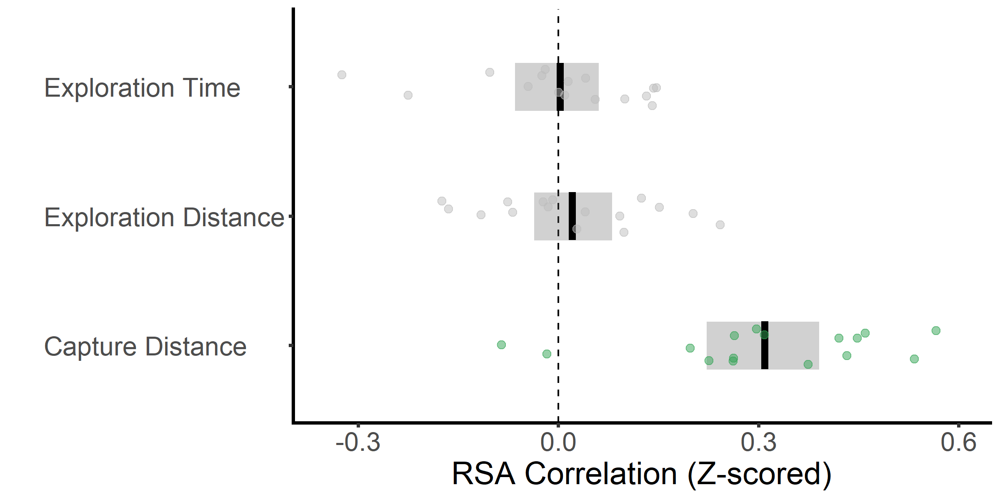
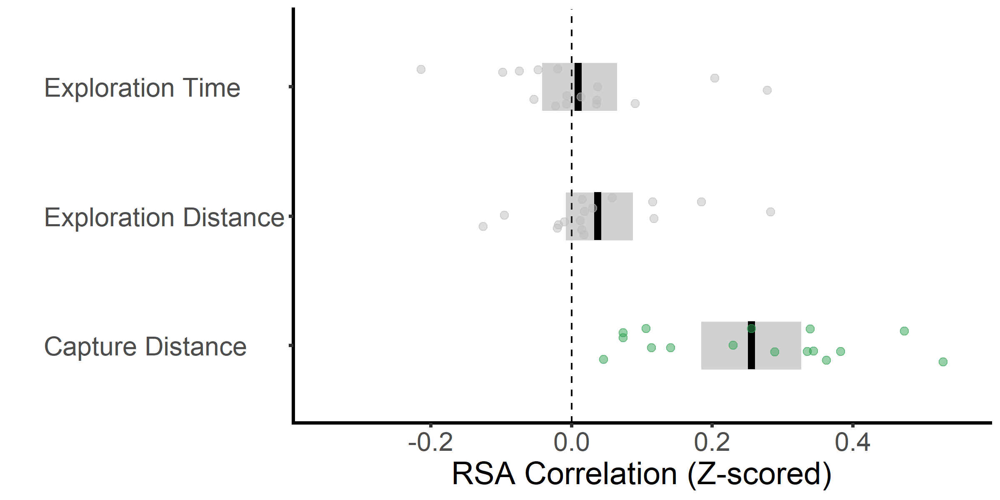
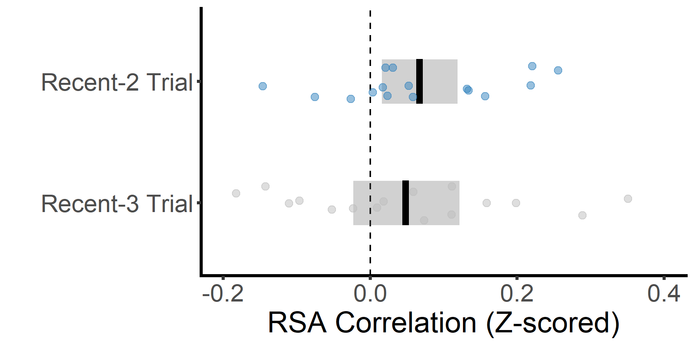
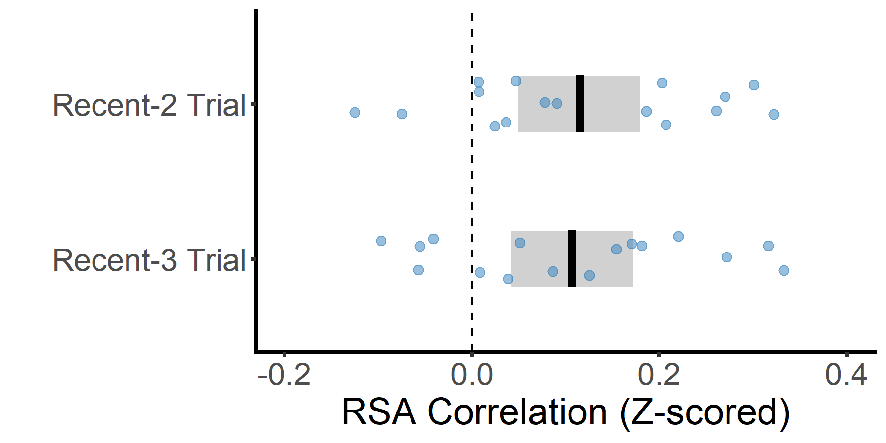
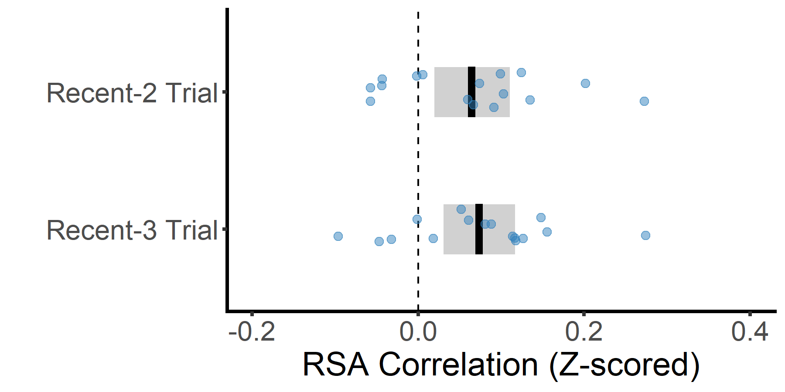
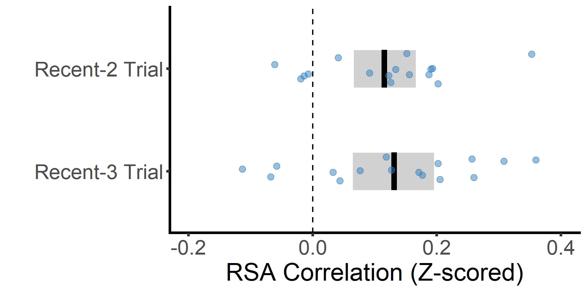
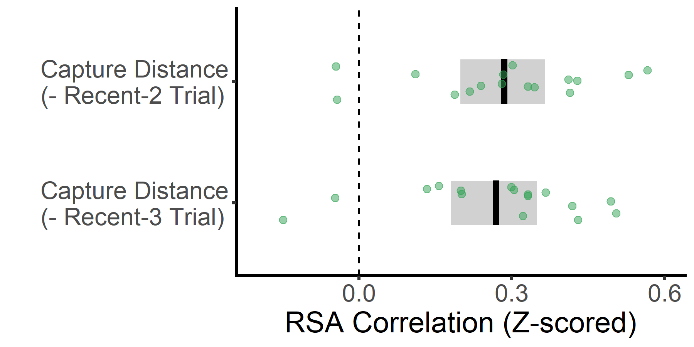
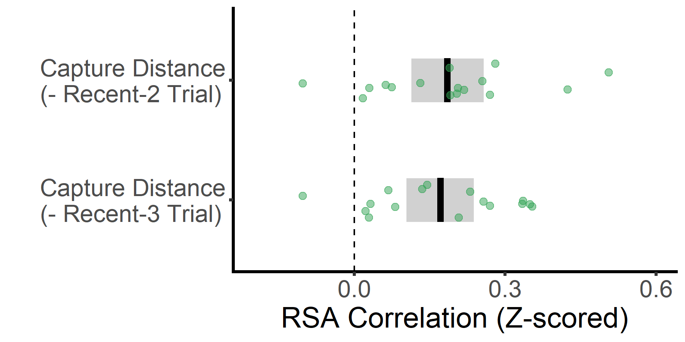
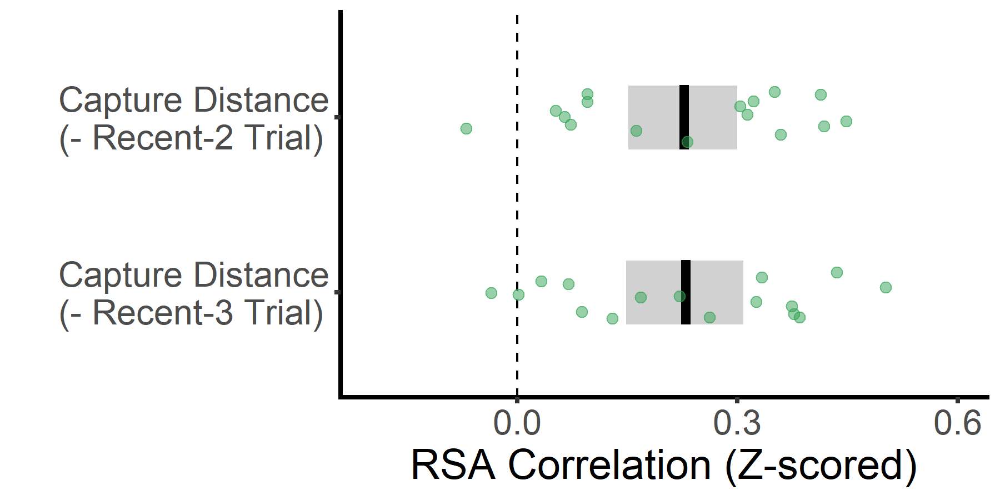

Photographer Feedback History Cluster Second-level RSA Visualization
================

- [Goal](#goal)
- [Notes](#notes)
- [Load libraries](#load-libraries)
- [Second-level RSA: Exploration
  models](#second-level-rsa-exploration-models)
  - [MiOG cluster](#miog-cluster)
  - [IFG cluster](#ifg-cluster)
- [Partial correlation second-level RSA: Feedback History
  models](#partial-correlation-second-level-rsa-feedback-history-models)
  - [MiOG cluster](#miog-cluster-1)
  - [IFG cluster](#ifg-cluster-1)
- [Partial correlation second-level RSA: Capture Distance
  model](#partial-correlation-second-level-rsa-capture-distance-model)
  - [MiOG cluster](#miog-cluster-2)
  - [IFG cluster](#ifg-cluster-2)

## Goal

- Visualization of second-level RSA results using exploration models
  - Exploration Time, Exploration Distance, Capture Distance models
  - No partial correlation
- Visualization of partial correlation-based RSA results
  - 1)  Feedback history models (Recent-2 or Recent-3 Trial) controlling
        for the Capture Distance model
  - 2)  Capture Distance model controlling for either Recent-2 or
        Recent-3 Trial model

## Notes

- MiOG/IFG Feedback History clusters
  - See
    `second-level/output/cross_validated_cluster_mask/recent_2_and_recent_3_trial`
- Second-level RSA results are from
  `second-level/output/second_level_rsa`

## Load libraries

``` r
knitr::opts_chunk$set(dpi = 300)

library(tidyverse)
```

    ## ── Attaching core tidyverse packages ──────────────────────── tidyverse 2.0.0 ──
    ## ✔ dplyr     1.1.4     ✔ readr     2.1.5
    ## ✔ forcats   1.0.0     ✔ stringr   1.5.1
    ## ✔ ggplot2   3.5.1     ✔ tibble    3.2.1
    ## ✔ lubridate 1.9.3     ✔ tidyr     1.3.1
    ## ✔ purrr     1.0.2     
    ## ── Conflicts ────────────────────────────────────────── tidyverse_conflicts() ──
    ## ✖ dplyr::filter() masks stats::filter()
    ## ✖ dplyr::lag()    masks stats::lag()
    ## ℹ Use the conflicted package (<http://conflicted.r-lib.org/>) to force all conflicts to become errors

``` r
library(easystats)
```

    ## # Attaching packages: easystats 0.7.3
    ## ✔ bayestestR  0.14.0   ✔ correlation 0.8.5 
    ## ✔ datawizard  0.12.3   ✔ effectsize  0.8.9 
    ## ✔ insight     0.20.4   ✔ modelbased  0.8.8 
    ## ✔ performance 0.12.3   ✔ parameters  0.22.2
    ## ✔ report      0.5.9    ✔ see         0.9.0

``` r
library(ggforce)
library(ggnewscale)
library(rstatix)
```

    ## 
    ## Attaching package: 'rstatix'
    ## 
    ## The following object is masked from 'package:modelbased':
    ## 
    ##     get_emmeans
    ## 
    ## The following objects are masked from 'package:effectsize':
    ## 
    ##     cohens_d, eta_squared
    ## 
    ## The following object is masked from 'package:correlation':
    ## 
    ##     cor_test
    ## 
    ## The following object is masked from 'package:stats':
    ## 
    ##     filter

``` r
library(ggpubr)
```

    ## 
    ## Attaching package: 'ggpubr'
    ## 
    ## The following objects are masked from 'package:datawizard':
    ## 
    ##     mean_sd, median_mad

``` r
library(lmerTest)
```

    ## Loading required package: lme4
    ## Loading required package: Matrix
    ## 
    ## Attaching package: 'Matrix'
    ## 
    ## The following objects are masked from 'package:tidyr':
    ## 
    ##     expand, pack, unpack
    ## 
    ## 
    ## Attaching package: 'lmerTest'
    ## 
    ## The following object is masked from 'package:lme4':
    ## 
    ##     lmer
    ## 
    ## The following object is masked from 'package:stats':
    ## 
    ##     step

``` r
library(broom.mixed)
library(AICcmodavg)
```

    ## 
    ## Attaching package: 'AICcmodavg'
    ## 
    ## The following object is masked from 'package:lme4':
    ## 
    ##     checkConv

``` r
library(emmeans)
```

    ## Welcome to emmeans.
    ## Caution: You lose important information if you filter this package's results.
    ## See '? untidy'

``` r
library(glue)
library(slider)
```

    ## 
    ## Attaching package: 'slider'
    ## 
    ## The following object is masked from 'package:datawizard':
    ## 
    ##     slide

``` r
# Define a global theme for visualization
global_theme <- theme(
    legend.position = "none",
    plot.title = element_text(size = 25, hjust = 0.3),
    axis.title = element_text(size = 18),
    axis.text = element_text(size = 15),
    strip.text = element_text(size = 18),
    panel.grid.minor = element_blank(),
    panel.grid.major = element_blank(),
    panel.border = element_blank(),
    axis.line = element_line(linewidth = 1, lineend = 'square'),
    axis.ticks = element_line(linewidth = 1),
    strip.background = element_blank(),
    panel.background = element_blank(),
  )
```

## Second-level RSA: Exploration models

``` r
# Helper function for visualization
# `limits`, `breaks` paramters define the x axis of the figure
# `exploration_sigs` define significant model names from the second-level RSA
plot_second_level_RSA_exploration <- function(data_df, limits, breaks, exploration_sigs) {
  long_df <- data_df %>%
    pivot_longer(exploration_time:capture_distance,
                 names_to = "model",
                 values_to = "correlation") %>%
    mutate(significant = case_when(
      model %in% exploration_sigs ~ "exploration",
      .default = "ns",
    )) %>%
  mutate(
    model = case_match(
      model,
      "exploration_time" ~ "Exploration Time",
      "exploration_distance" ~ "Exploration Distance",
      "capture_distance" ~ "Capture Distance",
    )
  ) %>%
  mutate(model = factor(
    model,
    levels = c(
      "Exploration Time",
      "Exploration Distance",
      "Capture Distance"
    ))
  )
  
  long_df %>%
    ggplot(aes(x = forcats::fct_rev(model), y = correlation)) +
    geom_hline(yintercept = 0.0, linetype = "dashed") +
    stat_summary(geom = "linerange", fun.data = "mean_cl_boot", fun.args = list(B = 10000), color = '#636363', alpha = 0.3, linewidth = 13) +
    stat_summary(geom = "crossbar", fun = mean, fun.min = mean, fun.max = mean, width = 0.37, linewidth = 0.8, color = 'black') +
    geom_jitter(aes(color = significant), size = 2, alpha = 0.5, width = 0.15, height = 0) +
    coord_flip() +
    labs(x = "", y = "RSA Correlation (Z-scored)") +
    scale_color_manual(values = c('ns' = '#bdbdbd', 'feedback' = '#3182bd', 'exploration' = '#31a354')) +
    scale_y_continuous(breaks = breaks, limits = limits) +
    theme_bw() +
    global_theme +
    theme(axis.text.y = element_text(hjust = 0))
}
```

### MiOG cluster

#### Discovery group

``` r
discovery_MiOG_exploration_df <- read_csv(
  "./data/second_level_rsa/exploration_second_level/discovery_MiOG_second_level.csv",
  col_types = cols(
    subgroup = col_factor(),
    subject_id = col_factor(),
    cluster = col_factor(),
    exploration_time = col_double(),
    exploration_distance = col_double(),
    capture_distance = col_double(),
  )
)
```

``` r
plot_second_level_RSA_exploration(discovery_MiOG_exploration_df, limits = c(-0.35, 0.6), breaks = c(-0.3, 0, 0.3, 0.6), exploration_sigs = c("capture_distance"))
```

<!-- -->

``` r
ggsave("./output/second_level_rsa/exploration_second_level/discovery_MiOG_exploration.png", height = 4, width = 8)
```

#### Validation group

``` r
validation_MiOG_exploration_df <- read_csv(
  "./data/second_level_rsa/exploration_second_level/validation_MiOG_second_level.csv",
  col_types = cols(
    subgroup = col_factor(),
    subject_id = col_factor(),
    cluster = col_factor(),
    exploration_time = col_double(),
    exploration_distance = col_double(),
    capture_distance = col_double(),
  )
)
```

``` r
plot_second_level_RSA_exploration(validation_MiOG_exploration_df, limits = c(-0.35, 0.6), breaks = c(-0.3, 0, 0.3, 0.6), exploration_sigs = c("capture_distance"))
```

<!-- -->

``` r
ggsave("./output/second_level_rsa/exploration_second_level/validation_MiOG_exploration.png", height = 4, width = 8)
```

### IFG cluster

#### Discovery group

``` r
discovery_IFG_exploration_df <- read_csv(
  "./data/second_level_rsa/exploration_second_level/discovery_IFG_second_level.csv",
  col_types = cols(
    subgroup = col_factor(),
    subject_id = col_factor(),
    cluster = col_factor(),
    exploration_time = col_double(),
    exploration_distance = col_double(),
    capture_distance = col_double(),
  )
)
```

``` r
plot_second_level_RSA_exploration(discovery_IFG_exploration_df, limits = c(-0.35, 0.55), breaks = c(-0.2, 0, 0.2, 0.4), exploration_sigs = c("capture_distance"))
```

<!-- -->

``` r
ggsave("./output/second_level_rsa/exploration_second_level/discovery_IFG_exploration.png", height = 4, width = 8)
```

#### Validation group

``` r
validation_IFG_exploration_df <- read_csv(
  "./data/second_level_rsa/exploration_second_level/validation_IFG_second_level.csv",
  col_types = cols(
    subgroup = col_factor(),
    subject_id = col_factor(),
    cluster = col_factor(),
    exploration_time = col_double(),
    exploration_distance = col_double(),
    capture_distance = col_double(),
  )
)
```

``` r
plot_second_level_RSA_exploration(validation_IFG_exploration_df, limits = c(-0.35, 0.55), breaks = c(-0.2, 0, 0.2, 0.4), exploration_sigs = c("capture_distance"))
```

<!-- -->

``` r
ggsave("./output/second_level_rsa/exploration_second_level/validation_IFG_exploration.png", height = 4, width = 8)
```

## Partial correlation second-level RSA: Feedback History models

``` r
plot_partial_correlation_second_level_RSA_feedback <- function(data_df, limits, breaks, feedback_sigs) {
  long_df <- data_df %>%
    pivot_longer(current_trial:previous_2_trial,
                 names_to = "model",
                 values_to = "correlation") %>%
    filter(model %in% c("recent_2_trial", "recent_3_trial")) %>% # Only using Recent-2 Trial and Recent-3 Trial models
    mutate(significant = case_when(
      model %in% feedback_sigs ~ "feedback",
      .default = "ns",
    )) %>%
  mutate(
    model = case_match(
      model,
     "recent_2_trial" ~ "Recent-2 Trial",
     "recent_3_trial" ~ "Recent-3 Trial"
    )
  ) %>%
  mutate(model = factor(
    model,
    levels = c("Recent-2 Trial", "Recent-3 Trial"))
  )
  
  long_df %>%
    ggplot(aes(x = forcats::fct_rev(model), y = correlation)) +
    geom_hline(yintercept = 0.0, linetype = "dashed") +
    stat_summary(geom = "linerange", fun.data = "mean_cl_boot", fun.args = list(B = 10000), color = '#636363', alpha = 0.3, linewidth = 13) +
    stat_summary(geom = "crossbar", fun = mean, fun.min = mean, fun.max = mean, width = 0.37, linewidth = 0.8, color = 'black') +
    geom_jitter(aes(color = significant), size = 2, alpha = 0.5, width = 0.15, height = 0) +
    coord_flip() +
    labs(x = "", y = "RSA Correlation (Z-scored)") +
    scale_color_manual(values = c('ns' = '#bdbdbd', 'feedback' = '#3182bd', 'exploration' = '#31a354')) +
    scale_y_continuous(breaks = breaks, limits = limits) +
    theme_bw() +
    global_theme +
    theme(axis.text.y = element_text(hjust = 0))
}
```

### MiOG cluster

#### Discovery group

``` r
discovery_MiOG_partial_feedback_df <- read_csv(
  "./data/second_level_rsa/partial_feedback_history_second_level/discovery_MiOG_partial_second_level.csv",
  col_types = cols(
    subgroup = col_factor(),
    subject_id = col_factor(),
    cluster = col_factor(),
    current_trial = col_double(),
    one_back_trial = col_double(),
    two_back_trial = col_double(),
    recent_2_trial = col_double(),
    recent_3_trial = col_double(),
    previous_2_trial = col_double(),
  )
)
```

``` r
plot_partial_correlation_second_level_RSA_feedback(discovery_MiOG_partial_feedback_df, limits = c(-0.2, 0.4), breaks = c(-0.2, 0, 0.2, 0.4), feedback_sigs = c("recent_2_trial"))
```

<!-- -->

``` r
ggsave("./output/second_level_rsa/partial_feedback_history_second_level/discovery_MiOG_partial_feedback.png", height = 3, width = 6)
```

#### Validation group

``` r
validation_MiOG_partial_feedback_df <- read_csv(
  "./data/second_level_rsa/partial_feedback_history_second_level/validation_MiOG_partial_second_level.csv",
  col_types = cols(
    subgroup = col_factor(),
    subject_id = col_factor(),
    cluster = col_factor(),
    current_trial = col_double(),
    one_back_trial = col_double(),
    two_back_trial = col_double(),
    recent_2_trial = col_double(),
    recent_3_trial = col_double(),
    previous_2_trial = col_double(),
  )
)
```

``` r
plot_partial_correlation_second_level_RSA_feedback(validation_MiOG_partial_feedback_df, limits = c(-0.2, 0.4), breaks = c(-0.2, 0, 0.2, 0.4), feedback_sigs = c("recent_2_trial", "recent_3_trial"))
```

<!-- -->

``` r
ggsave("./output/second_level_rsa/partial_feedback_history_second_level/validation_MiOG_partial_feedback.png", height = 3, width = 6)
```

### IFG cluster

#### Discovery group

``` r
discovery_IFG_partial_feedback_df <- read_csv(
  "./data/second_level_rsa/partial_feedback_history_second_level/discovery_IFG_partial_second_level.csv",
  col_types = cols(
    subgroup = col_factor(),
    subject_id = col_factor(),
    cluster = col_factor(),
    current_trial = col_double(),
    one_back_trial = col_double(),
    two_back_trial = col_double(),
    recent_2_trial = col_double(),
    recent_3_trial = col_double(),
    previous_2_trial = col_double(),
  )
)
```

``` r
plot_partial_correlation_second_level_RSA_feedback(discovery_IFG_partial_feedback_df, limits = c(-0.2, 0.4), breaks = c(-0.2, 0, 0.2, 0.4), feedback_sigs = c("recent_2_trial", "recent_3_trial"))
```

<!-- -->

``` r
ggsave("./output/second_level_rsa/partial_feedback_history_second_level/discovery_IFG_partial_feedback.png", height = 3, width = 6)
```

#### Validation group

``` r
validation_IFG_partial_feedback_df <- read_csv(
  "./data/second_level_rsa/partial_feedback_history_second_level/validation_IFG_partial_second_level.csv",
  col_types = cols(
    subgroup = col_factor(),
    subject_id = col_factor(),
    cluster = col_factor(),
    current_trial = col_double(),
    one_back_trial = col_double(),
    two_back_trial = col_double(),
    recent_2_trial = col_double(),
    recent_3_trial = col_double(),
    previous_2_trial = col_double(),
  )
)
```

``` r
plot_partial_correlation_second_level_RSA_feedback(validation_IFG_partial_feedback_df, limits = c(-0.2, 0.4), breaks = c(-0.2, 0, 0.2, 0.4), feedback_sigs = c("recent_2_trial", "recent_3_trial"))
```

<!-- -->

``` r
ggsave("./output/second_level_rsa/partial_feedback_history_second_level/validation_IFG_partial_feedback.png", height = 3, width = 6)
```

## Partial correlation second-level RSA: Capture Distance model

``` r
plot_partial_correlation_second_level_RSA_capture_distance <- function(data_df, limits, breaks, sigs) {
  long_df <- data_df %>%
    pivot_longer(capture_distance__recent_2_trial:capture_distance__recent_3_trial,
                 names_to = "model",
                 values_to = "correlation") %>%
    mutate(significant = case_when(
      model %in% sigs ~ "exploration",
      .default = "ns",
    )) %>%
  mutate(
    model = case_match(
      model,
     "capture_distance__recent_2_trial" ~ "Capture Distance\n(- Recent-2 Trial)",
     "capture_distance__recent_3_trial" ~ "Capture Distance\n(- Recent-3 Trial)"
    )
  ) %>%
  mutate(model = factor(model))
    # levels = c("Recent-2 Trial", "Recent-3 Trial"))
  
  long_df %>%
    ggplot(aes(x = forcats::fct_rev(model), y = correlation)) +
    geom_hline(yintercept = 0.0, linetype = "dashed") +
    stat_summary(geom = "linerange", fun.data = "mean_cl_boot", fun.args = list(B = 10000), color = '#636363', alpha = 0.3, linewidth = 13) +
    stat_summary(geom = "crossbar", fun = mean, fun.min = mean, fun.max = mean, width = 0.37, linewidth = 0.8, color = 'black') +
    geom_jitter(aes(color = significant), size = 2, alpha = 0.5, width = 0.15, height = 0) +
    coord_flip() +
    labs(x = "", y = "RSA Correlation (Z-scored)") +
    scale_color_manual(values = c('ns' = '#bdbdbd', 'feedback' = '#3182bd', 'exploration' = '#31a354')) +
    scale_y_continuous(breaks = breaks, limits = limits) +
    theme_bw() +
    global_theme +
    theme(axis.text.y = element_text(hjust = 0))
}
```

### MiOG cluster

#### Discovery group

``` r
discovery_MiOG_partial_capture_df <- read_csv(
  "./data/second_level_rsa/partial_capture_distance_second_level/discovery_MiOG_partial_second_level.csv",
  col_types = cols(
    subgroup = col_factor(),
    subject_id = col_factor(),
    cluster = col_factor(),
    capture_distance__recent_2_trial = col_double(),
    capture_distance__recent_3_trial = col_double(),
  )
)
```

``` r
plot_partial_correlation_second_level_RSA_capture_distance(discovery_MiOG_partial_capture_df, limits = c(-0.2, 0.6), breaks = c(0, 0.3, 0.6), sigs = c("capture_distance__recent_2_trial", "capture_distance__recent_3_trial"))
```

<!-- -->

``` r
ggsave("./output/second_level_rsa/partial_capture_distance_second_level/discovery_MiOG_partial_capture.png", height = 3, width = 6)
```

#### Validation group

``` r
validation_MiOG_partial_capture_df <- read_csv(
  "./data/second_level_rsa/partial_capture_distance_second_level/validation_MiOG_partial_second_level.csv",
  col_types = cols(
    subgroup = col_factor(),
    subject_id = col_factor(),
    cluster = col_factor(),
    capture_distance__recent_2_trial = col_double(),
    capture_distance__recent_3_trial = col_double(),
  )
)
```

``` r
plot_partial_correlation_second_level_RSA_capture_distance(validation_MiOG_partial_capture_df, limits = c(-0.2, 0.6), breaks = c(0, 0.3, 0.6), sigs = c("capture_distance__recent_2_trial", "capture_distance__recent_3_trial"))
```

<!-- -->

``` r
ggsave("./output/second_level_rsa/partial_capture_distance_second_level/validation_MiOG_partial_capture.png", height = 3, width = 6)
```

### IFG cluster

#### Discovery group

``` r
discovery_IFG_partial_capture_df <- read_csv(
  "./data/second_level_rsa/partial_capture_distance_second_level/discovery_IFG_partial_second_level.csv",
  col_types = cols(
    subgroup = col_factor(),
    subject_id = col_factor(),
    cluster = col_factor(),
    capture_distance__recent_2_trial = col_double(),
    capture_distance__recent_3_trial = col_double(),
  )
)
```

``` r
plot_partial_correlation_second_level_RSA_capture_distance(discovery_IFG_partial_capture_df, limits = c(-0.2, 0.6), breaks = c(0, 0.3, 0.6), sigs = c("capture_distance__recent_2_trial", "capture_distance__recent_3_trial"))
```

<!-- -->

``` r
ggsave("./output/second_level_rsa/partial_capture_distance_second_level/discovery_IFG_partial_capture.png", height = 3, width = 6)
```

#### Validation group

``` r
validation_IFG_partial_capture_df <- read_csv(
  "./data/second_level_rsa/partial_capture_distance_second_level/validation_IFG_partial_second_level.csv",
  col_types = cols(
    subgroup = col_factor(),
    subject_id = col_factor(),
    cluster = col_factor(),
    capture_distance__recent_2_trial = col_double(),
    capture_distance__recent_3_trial = col_double(),
  )
)
```

``` r
plot_partial_correlation_second_level_RSA_capture_distance(validation_IFG_partial_capture_df, limits = c(-0.2, 0.6), breaks = c(0, 0.3, 0.6), sigs = c("capture_distance__recent_2_trial", "capture_distance__recent_3_trial"))
```

<!-- -->

``` r
ggsave("./output/second_level_rsa/partial_capture_distance_second_level/validation_IFG_partial_capture.png", height = 3, width = 6)
```
